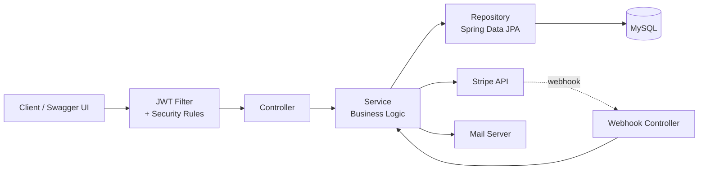
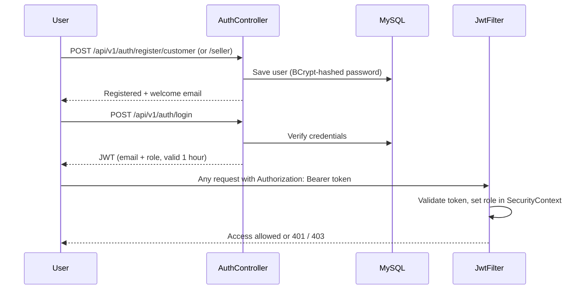
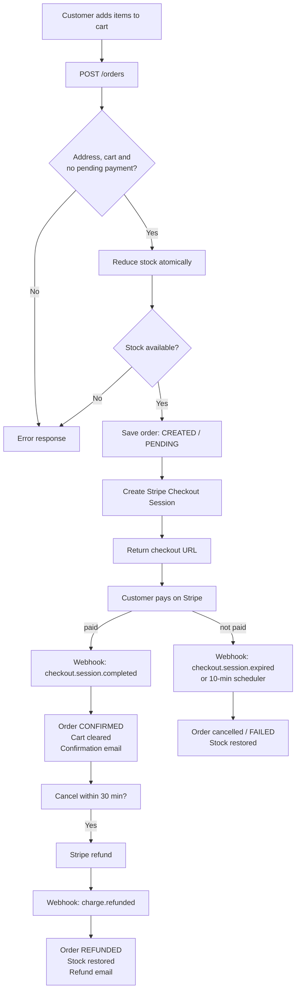
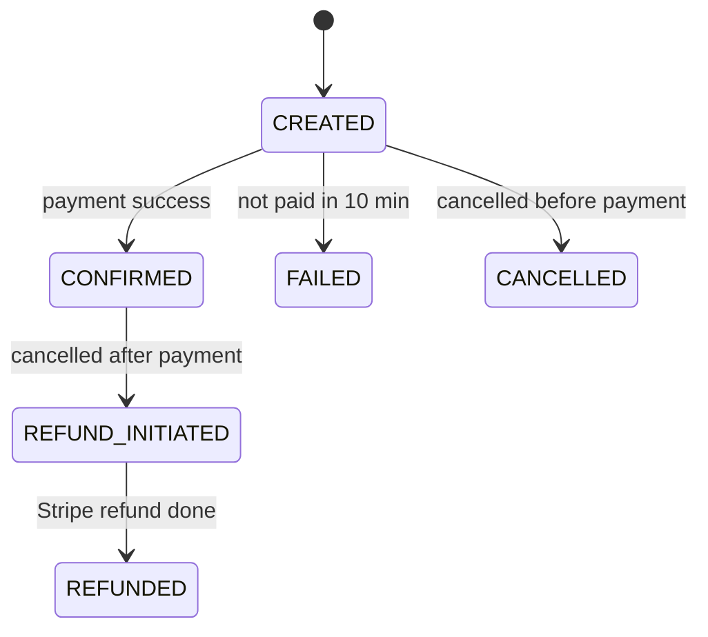
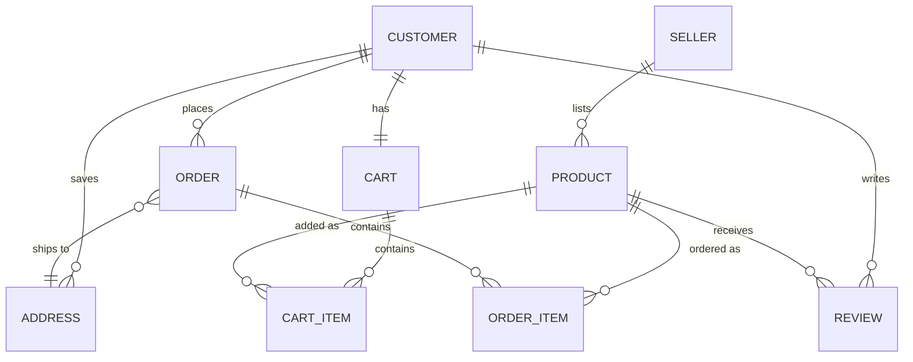

<div align="center">

# 🛒 E-Commerce Platform Backend

**Secure, role-based e-commerce REST API with Stripe payments, built on Spring Boot**


</div>

---

## 📌 Overview

A backend-only e-commerce application where **customers** shop, **sellers** list products and **admins** moderate the platform. It covers the full order lifecycle: **cart → order → Stripe checkout → webhook confirmation → email**, with automatic stock handling, cancellations and refunds.

No frontend needed: every API can be tested from **Swagger UI**.

---

## ✨ Features

| | Feature |
|---|---|
| 🔐 | **JWT authentication** (stateless, 1-hour tokens) with **BCrypt** password hashing |
| 👥 | **Role-based access**: `CUSTOMER`, `SELLER`, `ADMIN` (URL rules + `@PreAuthorize`) |
| 🛍️ | **Products**: seller CRUD, category filtering (Sports, Fashion, Technology, Grocery, Snacks, Skincare) |
| 🛒 | **Cart**: add / remove items, clear cart |
| 📍 | **Addresses**: add, update, delete, set default |
| 📦 | **Orders**: place, cancel, with multi-item order support |
| 💳 | **Stripe Checkout** (INR) with **signed webhooks** for payment confirmation, expiry and refunds |
| 🔁 | **Refunds**: cancel a paid order and it is refunded through Stripe |
| 📉 | **Safe stock handling**: atomic stock reduction at order time, restored on cancel / failure |
| ⏱️ | **Scheduler**: unpaid orders auto-expire after 10 minutes and stock is released |
| ⭐ | **Reviews**: add, update, delete, search by keyword or product |
| 📧 | **Async emails** (JavaMail): registration, order confirmed, cancelled, refunded |
| 🧯 | **Global exception handling** with clean, consistent error responses |
| 📖 | **Swagger / OpenAPI** documentation |

---

## 🧰 Tech Stack

| Layer | Technology |
|---|---|
| Language | Java 21 |
| Framework | Spring Boot 3.5.8, Spring MVC |
| Security | Spring Security, JWT (jjwt 0.13), BCrypt |
| Database | MySQL, Spring Data JPA (Hibernate) |
| Payments | Stripe Java SDK (Checkout + Webhooks) |
| Email | Spring Mail (JavaMail) |
| API Docs | springdoc-openapi (Swagger UI) |
| Build | Maven |
| Utilities | Lombok, Jakarta Validation |

---

## 🏗️ Architecture

Classic layered design: each layer has one job.



---

## 🔑 Authentication Flow



---

## 🛒 Order & Payment Flow



### Order status lifecycle



---

## 🗄️ Database Design



---

## 🔌 API Endpoints

Base path: `/api/v1`. Full interactive docs are in Swagger UI.

### 🔓 Auth (public)
| Method | Endpoint | Description |
|---|---|---|
| POST | `/auth/register/customer` | Register as customer |
| POST | `/auth/register/seller` | Register as seller |
| POST | `/auth/login` | Login and receive JWT |

### 🛍️ Products
| Method | Endpoint | Role | Description |
|---|---|---|---|
| GET | `/products` | Customer / Seller | List products (filter by category) |
| GET | `/products/{id}` | Customer / Seller | Product details |
| POST | `/products` | Seller | Add product |
| PUT | `/products/{id}` | Seller | Update product |
| DELETE | `/products/{id}` | Seller | Delete product |

### 🛒 Cart, 📍 Address, 📦 Orders (Customer)
| Method | Endpoint | Description |
|---|---|---|
| POST | `/cart/items` | Add item to cart |
| GET | `/cart` | View cart |
| DELETE | `/cart/items/{productId}` | Remove an item |
| DELETE | `/cart/clear` | Clear cart |
| POST | `/address/add` | Add address |
| GET | `/address` | List addresses |
| PUT | `/address/{id}` | Update address |
| PATCH | `/address/{id}/default` | Set default address |
| DELETE | `/address/{id}` | Delete address |
| POST | `/orders` | Place order (returns Stripe checkout URL) |
| DELETE | `/orders/{id}` | Cancel order (refund if already paid) |

### ⭐ Reviews
| Method | Endpoint | Description |
|---|---|---|
| GET | `/review/search?word=` | Search reviews by keyword |
| GET | `/review/search/{productId}` | Reviews of a product |
| GET | `/review/me` | My reviews |
| POST | `/review/products/{productId}` | Add review |
| PUT | `/review/{id}` | Update review |
| DELETE | `/review/{id}` | Delete review |

### 👤 Profile & 🛡️ Admin
| Method | Endpoint | Role | Description |
|---|---|---|---|
| GET / PUT / DELETE | `/customer/me` | Customer | View, update, delete own account |
| GET | `/seller/profile` | Seller | Seller profile |
| GET | `/admin/customers`, `/sellers`, `/products` | Admin | List everything |
| DELETE | `/admin/customers/{id}`, `/sellers/{id}` | Admin | Remove a user |
| POST | `/api/payments/webhook` | Stripe | Payment events (signature verified) |

---

## 🗂️ Project Structure

```
src/main/java/com/example/demo
├── controller/        REST endpoints
├── service/           Business logic
├── repository/        JPA repositories
├── model/             JPA entities
├── dto/               Request / response objects
├── transformers/      Entity <-> DTO mapping
├── security/          JWT filter, JWT utils, auth, user details
├── stripe/            Stripe service + webhook controller
├── configuration/     Stripe config, default admin initializer
├── enums/             Role, Category, OrderStatus, PaymentStatus, Gender
├── exception/         Custom exceptions + global handler
└── Utility/           Email, validation, order cleanup scheduler
```

---

## ⚙️ Getting Started

### Prerequisites
Java 21 · Maven · MySQL · a Stripe account (test mode) · an SMTP account

### 1. Clone
```bash
git clone https://github.com/dhruvkhurana1626/ecom-platform-backend.git
cd ecom-platform-backend
```

### 2. Set environment variables

| Variable | Purpose |
|---|---|
| `DB_URL`, `DB_USERNAME`, `DB_PAASWORD` | MySQL connection (the password variable is spelled `DB_PAASWORD` in the properties file) |
| `jwt_secret_key` | Secret used to sign JWTs |
| `STRIPE_SECRET_KEY` | Stripe API secret key |
| `STRIPE_WEBHOOK_SECRET` | Stripe webhook signing secret |
| `MAIL_HOST`, `MAIL_USERNAME`, `MAIL` | SMTP host, username, password |

### 3. Run
```bash
./mvnw spring-boot:run
```
The app starts on **http://localhost:8081** (prod profile).

### 4. Open Swagger UI
👉 **http://localhost:8081/swagger-ui/index.html**

### 5. Test payments locally
```bash
stripe listen --forward-to localhost:8081/api/payments/webhook
```
Copy the printed `whsec_...` value into `STRIPE_WEBHOOK_SECRET`.

---

## 🧪 Quick Test Flow

1. Register a **seller**, log in, and add a product.
2. Register a **customer**, log in, and add an address.
3. Add the product to the cart and call `POST /orders`.
4. Open the returned Stripe checkout URL and pay with test card `4242 4242 4242 4242`.
5. Check the order is `CONFIRMED` and the confirmation email arrives.

---

## 🚀 Future Improvements
- Razorpay support alongside Stripe
- Pagination and sorting on product listing
- Refresh tokens
- Docker + docker-compose setup
- Unit and integration test coverage

---

## 👤 Author

**Dhruv Khurana**
[GitHub](https://github.com/dhruvkhurana1626)
